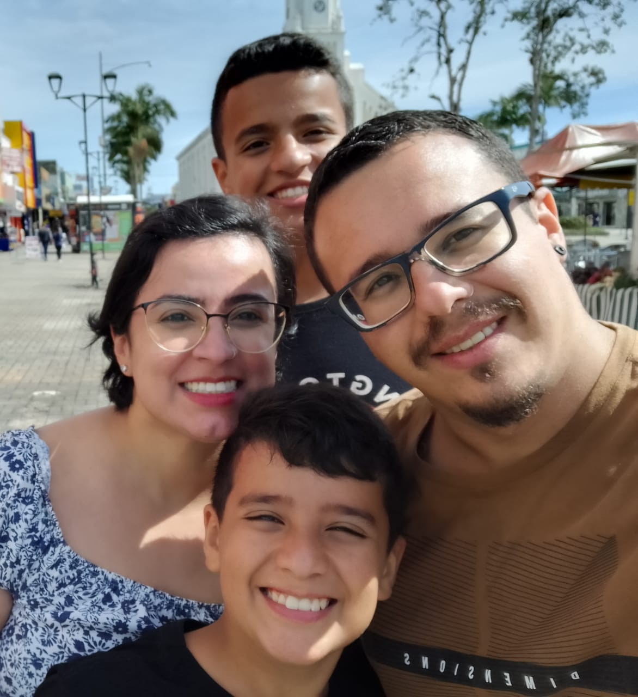

  

 
  
Atuei na área da saúde como técnica de enfermagem por 8 anos, e em 2022 decidi mudar minha carreira profissional. Por um misto de gostar de tecnologia, curiosidade e ânsia por crescimento pessoal, dei início aos estudos em Análise e desenvolvimento de Sistemas onde tenho confirmado a cada dia que tomei a melhor decisão

  
Atualmente faço parte do curso do na <a href="https://github.com/devemdobro" target="_blank">Dev Quest</a> e tambem faço cursos complementares na <a href="https://www.rocketseat.com.br/" target="_blank">Rocketseat</a>, <a href="https://estudonauta.com" target="_blank">Estudonauta</a> / <a href="https://www.cursoemvideo.com/" target="_blank">Curso em Video</a>, e <a href="https://www.udemy.com/courses/search/?src=ukw&q=front+end" target="_blank">Udemy</a> 
Busco ingressar na área de tecnologia e venho desenvolvendo competências com voltados ao desenvolvimento web que abrange <a href="https://developer.mozilla.org/pt-BR/docs/Web/HTML" target="_blank">HTML</a> , <a href="https://developer.mozilla.org/pt-BR/docs/Web/CSS" target="_blank">CSS</a> , <a href="https://developer.mozilla.org/pt-BR/docs/Web/JavaScript" target="_blank">Javascript</a>, e tenho desejo de aprender cada vez mais, estou sempre buscando novas tecnologias.</li> 
     
  
    

      
Curiosidades sobre mim

      <ul>
        <li> Sou natural de <a href="https://pt.wikipedia.org/wiki/S%C3%A3o_Jos%C3%A9_dos_Campos" target="_blank">São Jose dos Campos</a> Mas atualemente, moro em <a href="https://www.visitejoinville.com.br/" target="_blank">Joinville-SC</a> </li>  
        <li>Adoro ler, ebooks ultimamente tem sido minha paixão.</li>
        <li> Estou lendo atualmente <a href="https://www.amazon.com.br/arte-fazer-acontecer-Estrat%C3%A9gias-produtividade/dp/8543102812/ref=asc_df_8543102812/?tag=googleshopp00-20&linkCode=df0&hvadid=379708192683&hvpos=&hvnetw=g&hvrand=16849188794374805852&hvpone=&hvptwo=&hvqmt=&hvdev=c&hvdvcmdl=&hvlocint=&hvlocphy=9102349&hvtargid=pla-811770767898&psc=1" target="_blank">A arte de fazer acontecer</a></li>
        <li>Adoro ouvir podcasts, os principais que escuto são: <a href="https://open.spotify.com/show/2kCrTjsGn431qiGpl9quAl?si=2cd20d63599c4668" target="_blank">Dev em dobro.</a> ,<a href="https://open.spotify.com/show/14jalMOh1Jr77eTRUdN6X9?si=d50fe5c8b5da4345" target="_blank"> Inteligência Ltda.</a> , <a href="https://open.spotify.com/show/3V5LBozjo4vNg2oJoA4Wb2?si=cd2d2dfc6f844a55" target="_blank"> Flow</a>, 
        <a href="https://open.spotify.com/show/2XyVyDbnjlhojU0qsdR3zq?si=a92e3439f1eb4bef" target="_blank"> Saia Justa</a>,
        <a href="https://open.spotify.com/show/6JdH6H6lZGV0lP2uTVjdfw?si=ab31b10b86bb40e8" target="_blank"> Papo de Segunda</a>
        </li>
         <li>Amo estar com meu esposo e filhos </li>
        
      </ul>
    

 
 <b> Ouvindo Atualmente no Spotify </b> 

 

 
 

 

<table align="center" height="185px">
<tr>
   <td >
      <a href="https://developer.mozilla.org/en-US/docs/Web/HTML/">
         
        
          <b>
            <pre>HTML5</pre>
          </b>
        
      </a>
    </td>
    <td align="center">
      <a href="https://developer.mozilla.org/en-US/docs/Web/CSS/">
         
        
          <b>
            <pre>CSS3</pre>
          </b>
        
      </a>
    </td>
     <td align="center">
      <a href="https://developer.mozilla.org/en-US/docs/Web/JavaScript/">
         
        
          <b>
            <pre>Javascript</pre>
          </b>
        
      </a>
    </td>
    <td align="center">
      <a href="https://github.com/">
         
        
          <b>
            <pre>GitHub</pre>
          </b>
        
      </a>
    </td>
</table>

<table align="center" height="185px">
 <tr>
    <td align="center">
      <a href="https://git-scm.com/downloads">
         
        
          <b>
            <pre>Terminal</pre>
          </b>
        
      </a>
    </td>
    <td align="center">
      <a href="https://code.visualstudio.com/">
         
        
          <b>
            <pre>VSCode</pre>
          </b>
        
      </a>
    </td>
    <td align="center">
      <a href="https://www.figma.com/ui-design-tool/">
         
        
          <b>
            <pre>Figma</pre>
          </b>
        
      </a>
    </td>
    <td align="center">
      <a href="https://www.notion.so/pt-br">
         
        
          <b>
            <pre>Notion</pre>
          </b>
        
      </a>
    </td>
  </tr>
  </table>

  

  

     
 

 

<table height="355px" align="right">
  <tr>
    <td>
    
    </td>
  </tr>
  <tr>
    <td>
         
    </td>
  </tr>
  <tr>
    <td>
   
    </td>
  </tr>
  <tr>
    <td>
    
    </td>
  </tr>
 
</table>

 

  
   
  

   
 
